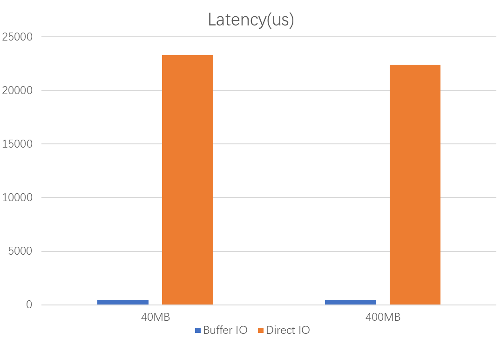

# Main Design in ElasticBF

## Fine-grained Bloom Filter Allocation

From the perspective of a Table, a point query needs to go through the following components in sequence: Table, Meta Index Block, FilterBlock, and Bloom Filter. Therefore, our implemention revolves around this path.

```C++
          /\
         /  \
        /  <-\-- Table
       /------\
      /        \
     /     <----\---- MetaIndexBlock
    /------------\
   /       <------\--- FilterBlockReader
  /----------------\
 /         <--------\--- Bloom Filter
/--------------------\
```
### BloomFilter

> related file:
> - util/bloom.cc
> - include/leveldb/filter_policy.h 

In a bloom filter, different keys will produce different hash values without considering hash collisions, but in ElasticBF, what we want to achieve is the design of a multi-bloom filter, so even if the same key, In different bloom filters, different hash values will be generated, so double hashing is used to calculate different initial hash function values for each filter unit, and then several hash function values are generated for a filter unit through this value:

```
            ----key----
            ↓         ↓
bitmap1 [01010110101001101010]

         --------key--
         ↓           ↓
bitmap2 [10010110101010000101]

······························
    
           ------key---
           ↓          ↓
bitmapn [10110110111001111001]
```

Two hash functions we selected:

```
f1(x) = Hash(x)
f2(x) = (f1(x) >> 17) | (f(x) << 15)
```

In a filter unit indexed to ``index``, to calculate the hash value generated by the hash function, LevelDB also uses double hashing, that is, to generate two hash values, and then generate k hash values based on the two hash values.

```
f_original_hash(x, index) = [f1(x) + index * f2(x)]
```
Where index is the subscript of the filter unit, and based on this hash value, we can generate an auxiliary function:

```
f_delta(x, index) = (f_original_hash(x, index) >> 17) | (f_original_hash(x, index) << 15)
```
Based on these two hash values, we can calculate the hash function value of the filter unit indexed with index k:

```
f_hash(x, index) = f_original_hash(x, index) + k * f_delta(x, index)
```

**Note**: in fact, the false positive rate of the bloom filter is not only related to the configuration of the bitmap, but also to the hash function. The difference in the seed of the hash function will affect its collision rate. The false positive rate of LevelDB's default hash function seed is not low in the Doblong filter scenario, so we modified the seed of the hash function.

### FilterBlock

> related file:
> - table/filterblock.cc
> - table/filterblock.h

The format of the new filterblock is as follows, divided into two parts, the disk part and the memory part. When reading the filterblock, only the memory part will be read. The memory part will read several from the disk according to the offset and size of the saved filter unit. When querying, the filterblock will traverse all the filter units that have been loaded. Since the Bloom filter has no false negative rate, as long as a Bloom filter determines that the key does not exist, then this key will definitely not exist..

```
<beginning_of_file>
[filter unit 1] // same size but different contents
[filter unit 2]
...
[filter unit N]                              in disk
----------------------------------------------------
[filter offset1]                             (meta) in memory
[filter offset2] // common to all filter units
...
[filter offsetM]
[filter unit's len] // desgin for last bitmap reading
[offset in disk] // first filter unit offset in disk
[size]   // first filter unit size in disk
[loaded] // filter unit number we should load when read table
[number] // all filter units number 
[baselg] 
<end_of_file>
```

**Note**: It is worth noting that the size of each filter unit is the same, and the filter units are closely arranged, so we only need to save the offset and size of the first filter unit. In the process of reading, crc needs to be used for verification to prevent reading the wrong bitmap and misjudgment, so that the existing key is judged to not exist, resulting in data loss.

**Note**: In the process of implementation, because only TableBuilder saves the entire SSTable file offset, when we generate all the filter units, we need to return to TableBuilder for persistence, get the offset and size of the filter unit from TableBuilder, and then return to FilterBlock to complete the construction of the memory part.

**Note**: LevelDB uses InternalFilterPolicy to wrapper the Bloom Filter. This filter will convert the InternalKey with the serial number and KV type into the user key passed by the user, and then insert it into the Bloom filter to build a bitmap, but in ElasticBF, We need to generate a bitmap for a set of keys, which will cause the InternalKey that has been converted to the user key to be converted again, resulting in a parsing error. The solution is to add a flag to convert only when the first filter unit is generated. Just see this [code](https://github.com/WangTingZheng/Paperdb/blob/242b1b92cf97453d7750ea6f630cb490bb14feb7/db/dbformat.cc#L108)

### Meta Index Block

> related file:
> - table/table.cc
> - table/table_builder.cc

The implementation of ElasticBF does not require any modification to the Meta index block, but because we have re-modified the format of the FilterBlock, the filter unit that occupies most of the space is saved in the disk. We only need to read the meta data from the disk. Dynamically load the filter unit in the disk, which makes the filterblock very small. Obtain the offset and size of the filter block from the Meta Index Block, and then read the filter block to the disk according to them, it is a waste of IO, so I choose to save the filterblock directly to the value in Meta Index Block. There is no need to read FilterBlock from disk anymore, after reading meta index block.

```
LevelDB version:

key
↓
Meta Index Block -> offset, size
                    ↓  （one disk io）
                    FilterBlock Contents
                    ↓
                    FilterBlockReader
------------------------------------------      
ElasticBF version:

key
↓                   (save io here)
Meta Index Block -> FilterBlock Contents
                    ↓ 
                    FilterBlockReader
```

### Table

> related file:
> - table/table.cc
> - table/table_builder.cc

Table adapts to two situations, one is that we use the default way of LevelDB to read filterblock, the other is to use multi_queue to manage filterblock, and the two switch to option.multi_queue is set.

When the option of the multi_queue is nullptr, we will open the Table, directly from the disk to read data to create filterblockreader object, if not nullptr, indicating the need to filterblockreader by the multi_queue management, then we open the Table, from disk to create filterblockreader read data object is inserted into the multi_queue, while returning a handle containing the reader for query use.

|  configuration        | if load filter  | where manage filter  | where manage filter |  
|  ----                 | ----            |      ---             |  ---                |
| not use bf            | ❌              |  ❌                  |  ❌                |  
| use bf, no adjustment | 🆙              |  📃                  |  👁️‍🗨️                |  
| use bf, has adjustment| 🆙              |  MQ                  |  👁️‍🗨️                |

When the table is released due to program exit or TableCache replacement policy, the reader saved in the table will be freed, but the handle saved multi_queue only will be release which mean all filter units will be evicted but meta data(hotness etc) will be saved in multi queue.

## Hotness Identification

> related file:
> - table/filterblock.cc
> - table/filterblock.h

When the key is passed in the KeyMayMatch in the filterblockreader, we will parse the Sequence Number from the InternalKey, update the sequence in the filterblockreader, and determine whether the FilterBlock is cold, we pass in the Sequence Number of the read request at that time. If it is greater than or equal to the sequence of the filterblockreader plus life_time, it means that this filterblockreader has not been accessed within the life time, which is a cold FilterBlock.

## Bloom Filter Management in Memory

> related file:
> - util/multi_queue.cc
> - util/multi_queue.cc

### Main components
Multi Queue structure just like this:
```
HashTable:

   -----------------------
   | key  | QueueHandle* |----
   -----------------------   |
   | key  | QueueHandle* |   |
   ----------------------    |
   | key  | QueueHandle* |   |
   ----------------------    |
                             |
                             ↓
                         QueueHandle-------
                           ↑ ↑            ↓
                           | |          reader  
                           | | equal   
                    ----->     ----->      ---->
SingleQueue1     mlu      node1       node2     lru
                    <----      <-----      <----

                    ----->     ----->      ---->
SingleQueue2     mlu      node1       node2     lru
                    <----      <-----      <----
                    
                    ----->     ----->      ---->
SingleQueue3     mlu      node1       node2     lru
                    <----      <-----      <----

```

- QueueHandle: A node in a linked list, encapsulating filterblockreader
- SingleQueue: An LRU linked list containing filterblockreaders loaded with the same number of filter units. The accessed QueueHandle will be updated to the previous node of the header node
- MultiQueue: a multi-level queue composed of multiple linked lists, from the linked list with more filter units to the linked list with fewer filter units, start querying the cold FilterBlockReader from the LRU section of the linked list, and query the required cold FilterBlockReader with minimal cost

### Insert and search in SingleQueue
Empty SingeQueue:
```
   (next)
mlu----->lru 
↑         ↓(prev)
----------|
```

Insert or move a new Handle to MLU end:

```
new--------
↓(prev)   ↓(next)
mlu----->lru 
↑         ↓
----------|

---------------------------------

       ----------new--------
 (next)↑ ↓(prev)   (next)↓ ↑(prev)
 mlu                     lru 
```

Find Cold handle from lru to mru end

```
   ----->     ----->      ---->
mlu      node1       node2     lru
   <----      <-----      <----
         [<--------------]
              search
```

**Node**: Internal node mlu/lru has no key, call Key() will be crashed.

### Background thread 

We use a background thread created by MQSchedule in ``until/mq_schedule.cc`` to load filters when filterblock reader is just created. Other thread maybe use filterblockreader which is not loaded, so, we use a flag [``done``](https://github.com/WangTingZheng/Paperdb/blob/f9f83f2fb70d039e2b6943b9bbd0c34a9142bf30/table/filter_block.h#L191) and a [``condition variable``](https://github.com/WangTingZheng/Paperdb/blob/f9f83f2fb70d039e2b6943b9bbd0c34a9142bf30/table/filter_block.h#L192) to make other thread wait before background thread finish loading. More detail just see this [``commit``](https://github.com/WangTingZheng/Paperdb/commit/db7e954df35fc93e98c99ddd89aad13bef37762f)


```
                                         |                   |-------------------------|    |
                                 --------------------        |  using reader mutually  |    |
[main thread lifeline]           |                  |        |   with other thread     |    |
---------------------------------|want to use reader|--------|-------------------------|----------------------→
      | schedule a               |                  |         ↑ wake up|               |    |
      | background thread        --------------------         |        |               |    |
      | to loading filter                |                 |-------------------|       |    |
      ↓----------------------------------------------------|  finished loading |------------------------------→
         [background thread lifeline]    |                 |-------------------|       |    |
                                         |                             |               |-----------------------
                                         |                             |               | start to use reader  |
                                         |                             |             --------------------------
[other thread thread lifeline]           |                             |             |                  |
-------------------------------------------------------------------------------------|want to use reader|------→
                                         |                             |             |                  |         
                                         |                             |             --------------------  
                                         |                             |                     |
                         done is false,main thread waiting      done is set true             |
                                                         sigal main thread at same time      |
                                                                                          done is true now
                                                                                           will not wait
                                                                                       use reader directly
```

**Note:** Call env->Schedule() in env->Schedule() when Compaction thread want to insert a reader into multi queue will meet a deadlock, so we use an independent Schedule call MQSchedule to load filter in background thread.
**Note:** We also use a background thread to adjust filter units in multi queue to reduce overhead in Get() Path.

### Adjustment policy

- Collect Cold FilterBlockReader: Calculate how much memory is required to load the filter unit of a hot filterblockreader, from the list with more filter units to the list with less, the LRU end of the linked list to the MRU end, and judge whether a FilterBlockReader is cold through SequenceNumber. If it is cold, save it. If you can collect no less than the memory of the cold Reader loading the filter unit of a hot reader, return the reader's collection. If it is not complete, return empty.
- Determine whether it should be adjusted: If no suitable cold reader is found, it is directly considered unadjustable. If there is, it is judged that all of these cold Readers evict a filter unit, and the resulting disk IO can be offset by loading a hot Reader.
- Apply adjustment: If should be adjusted, evict all the cold readers with a filter unit and load the hot reader with a filter unit.

**Note**: The total memory footprint of the filter unit of the evicted cold reader cannot be less than the memory footprint of a filter unit of the loaded hot reader, and a little more is fine.

**Note**: A cold reader with only one filter unit cannot be selected, and the false positive rate without a filter unit is not easy to calculate.

**Note**: We add a lock into multi queue to support multi threads, LevelDB's benchmark is under multi threads.

## Hotness Inheritance

>related file:
>- db/db_impl.cc
>- util/multi_queue.cc

The purpose of hotness inheritance is to allow LevelDB to inherit the hotness (access frequency) information from the input tables when generating new tables through Compaction, so that it does not need to accumulate from scratch. This enables the hotness of the table to better reflect its access situation.

The main algorithm for hotness inheritance is as follows: Firstly, we need to obtain the range and hotness information of all input tables. When we generate a new table, we obtain its range and then search for overlapping tables in the input tables. These tables can be regarded as the data sources for the new table. We can add up the hotness of these tables and take an average, which becomes the hotness of the new table.
To implement hotness inheritance, it mainly involves the following steps:

1. **Collecting the hotness information** of each participating SSTable  during compaction.
2. **Calculating the hotness information** of each output SSTable after compaction.
3. **Updating the hotness information** into the Multi Queue.

### Collecting the hotness information

After Compaction is completed, when calling InstallCompactionResults, we collect the hotness of the SSTables involved in the compaction. At this point, the SSTables involved in the compaction have been read into memory but have not been cleaned yet from the disk, so the hotness data of these FilterBlocks is available in the Multi Queue.

### Calculating the hotness information 

**Q: When?**

We need to calculate the hotness information after Compaction is completed. Due to the existence of two-level iterators, the process of obtaining the hotness information of the input Tables is done in real-time. This means that not all of the input Table's hotness are collected when constructing a new Table during Compaction. However, in order to implement heat inheritance, we must obtain the hotness information of all Tables.

Therefore, we choose to calculate the hotness in the InstallCompactionResults function, which is executed after Compaction is finished. This function inserts the constructed Table's metadata into the Version.

**Q: How?**

As mentioned above, in InstallCompactionResults, when applying a Table, we will search for a portion of the input Tables that have overlapping ranges with the generated Table's key range. We then collect the hotness information of these overlapping Tables and calculate the average by adding them together.

### Updating the hotness information

**Q: When?**

Once the hotness information of a Table is calculated, we immediately set and store it in the Multi Queue. According to our design, once a Table is read, its hotess information will be stored in the Multi Queue unless the DB is destroyed or the Table file is deleted. After constructing a Table, we will read it into the Table for testing if can be used, and at this point, the Multi Queue will have the hotness information stored.

**Q: How？**

We obtain the file number of a Table from its metadata, and then query its corresponding FilterBlockReader in the Multi Queue. We set the hotness information in the Reader.

## DirectIO

> related file:
> - util/env_posix.cc
> - util/env_windows.cc
> - util/read_buffer.cc

### Why DirectIO？

The premise of ElasticBF is based on the assumption that reading the data block is the performance bottleneck for the entire Get request. However, LevelDB implements mmap and buffer IO, which means that small-sized read requests are often intercepted in memory and do not actually read from the disk. In cases where the workload is skewed, the buffer in buffer IO may handle most of the Get requests. Moreover, there is an overhead to adjust. As a result, the advantages of ElasticBF may not be fully realized in situations where LevelDB's mmap and buffer IO mechanisms are already handling the majority of small-sized read requests efficiently.

DirectIO bypasses the operating system's cache and directly accesses the disk. By using DirectIO, reading blocks can become a performance bottleneck, allowing ElasticBF to truly come into effect. However, it is worth mentioning that DirectIO only bypasses the operating system's cache, while there may still be caches within the SSD itself that cannot be circumvented. Unfortunately, LevelDB does not implement DirectIO, so it would be necessary to implement it on my own.

### How DirectIO design？

In terms of implementation, there are two key differences between DirectIO and Buffer IO:

1. Firstly, when opening a file, a flag **O_DIRECT** needs to be added. However, the handling may differ for macOS and Windows. You can refer to the RocksDB documentation on [DirectIO](https://github.com/facebook/rocksdb/wiki/Direct-IO) for more details.

2. Secondly, DirectIO requires that the offset, read size, and memory block for storing data are all aligned. This is because DirectIO directly accesses the disk and reads according to the disk block size.

In LevelDB, the caller of the Read interface is responsible for allocating memory. However, since DirectIO requires alignment, the memory allocated by the caller may not meet the requirements of DirectIO. In cases where compatibility with Buffer IO is necessary, the user doesn't know whether the underlying implementation is using DirectIO or Buffer IO. Therefore, the responsibility of memory allocation should not be placed on the caller. As a result, we choose to let the Read function handle the memory allocation.

However, if the Read function is responsible for memory allocation, it could potentially lead to memory leaks. This is because only a portion of the allocated memory is returned to the user, and when the user releases the memory, they are only releasing a portion of what was allocated. Therefore, we must pass the memory address allocated by the Read function to the user so that they can release it properly.

A straightforward approach is to use a two-level pointer. Since aligned memory allocated on Windows cannot be freed using the `free` function and requires a special `_aligned_free` function, it is possible that Buffer IO, which does not require aligned memory, may be used on the Windows platform. To distinguish between these two cases, we can wrap a flag around the address pointer to indicate whether the address is aligned or not. Based on this flag and the current operating system, we can choose the appropriate release function to free the resources. This wrapping is done in the ReadBuffer structure. Here are the different scenarios for selecting the release function:

|           |  Posix(Linux, Macos) |  Windows   |
|-----------|----------------------|-------------|
|aligend    |  free                | aligned_free|
|not aligend|  free                |  free    |

**Note:** I set 512 for alignment of Direct IO, if user pass true in ReadBuffer constructor, We will use page size to align.

### Performance

I tested the latency diff between Buffer IO and Direct IO, we create a 4MB/400MB file and read a same 512Byte place 100 times, you can see buffer IO is fast than Direct IO so much, this because Buffer IO uses page cache to improve read performance: 



If use want to get more information about IO, such as mmap, you can read this paper: **Are You Sure You Want to Use MMAP in Your Database Management System?**
